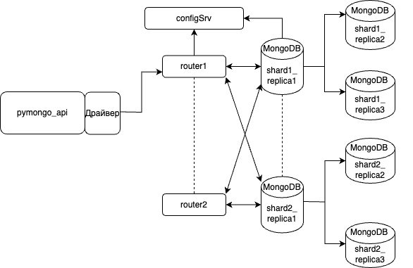

# Задание 3. Репликация [директория mongo-sharding-repl]

## Схема:



Ниже будет приведен алгоритм ручной настройки всех контейнеров. Однако все эти команды уже приведены в скрипте shell -
shell.sh. Вместо ручной настройки можно запустить его командами:

```shell
sudo chmod u+x shell.sh
./shell.sh
```

По результатам выполнения скрита все контейнеры будут проинициализированы и на каждом шарде будет записано около 1000
записей.

Как было сказано выше, альтернативный вариант - настройка вручную:

## 0) Запуск всех контейнеров

```shell
 docker compose up -d
```

## 1) Настраиваем сервер конфигурации.

Выполняем в терминале:

```shell
 docker exec -it configSrv mongosh --port 27017
```

Выполняем в контейнере:

```shell
rs.initiate({
    _id: "config_server",
    configsvr: true,
    members: [{
        _id: 0,
        host: "configSrv:27017"
    }]
});
exit
```

## 2) Настраиваем шард1 и шард2

Выполняем в терминале:

```shell
docker exec -it shard1_replica1 mongosh --port 27017
```

Выполняем в контейнере:

```shell
rs.initiate({
    _id: "shard1",
    members: [{
        _id: 0,
        host: "shard1_replica1:27017"
    },
    {
        _id: 1,
        host: "shard1_replica2:27017"
    },
    {
        _id: 2,
        host: "shard1_replica3:27017"
    }]
});
exit();
```

Выполняем в терминале:

```shell
docker exec -it shard2_replica1 mongosh --port 27017
```

Выполняем в контейнере:

```shell
rs.initiate({
    _id: "shard2",
    members: [{
        _id: 0,
        host: "shard2_replica1:27017"
    },
    {
        _id: 1,
        host: "shard2_replica2:27017"
    },
    {
        _id: 2,
        host: "shard2_replica3:27017"
    }]
});
exit();
```

## 3) Настраиваем роутер1 и роутер2

Выполняем в терминале:

```shell
docker exec -it router1 mongosh --port 27020
```

Выполняем в контейнере:

```shell
sh.addShard( "shard1/shard1_replica1:27017");
sh.addShard( "shard1/shard1_replica2:27017");
sh.addShard( "shard1/shard1_replica3:27017");
sh.addShard( "shard2/shard2_replica1:27017");
sh.addShard( "shard2/shard2_replica2:27017");
sh.addShard( "shard2/shard2_replica3:27017");
sh.enableSharding("somedb");
sh.shardCollection("somedb.helloDoc", { "name" : "hashed" } )
exit();
```

Выполняем в терминале:

```shell
docker exec -it router2 mongosh --port 27021
```

Выполняем в контейнере:

```shell
sh.addShard( "shard1/shard1_replica1:27017");
sh.addShard( "shard1/shard1_replica2:27017");
sh.addShard( "shard1/shard1_replica3:27017");
sh.addShard( "shard2/shard2_replica1:27017");
sh.addShard( "shard2/shard2_replica2:27017");
sh.addShard( "shard2/shard2_replica3:27017");
sh.enableSharding("somedb");
sh.shardCollection("somedb.helloDoc", { "name" : "hashed" } )
exit();
```

## 4) Проверяем работоспособность

### Запись данных через первый роутер

Для этого зальем данные на роутеры и проверим, что данными заполняются оба шарда.
Выполняем в терминале:

```shell
docker exec -it router1 mongosh --port 27020
```

Заполняем роутер1 1000 записей. Выполняем в контейнере:

```shell
use somedb
for(var i = 0; i < 1000; i++) db.helloDoc.insert({age:i, name:"ly"+i})
db.helloDoc.countDocuments()
exit
```

Проверяем данные на первом шарде. Выполняем в терминале:

```shell
docker exec -it shard1_replica1 mongosh --port 27017
```

Выполняем в контейнере:

```shell
use somedb;
db.helloDoc.countDocuments();
exit();
```

Выведенное число должен быть примерно равно размеру половины коллекции (±500).
Проверяем данные на втором шарде. Выполняем в терминале:

```shell
docker exec -it shard2_replica1 mongosh --port 27017
```

Выполняем в контейнере:

```shell
use somedb;
db.helloDoc.countDocuments();
exit();
```

Выведенное число должен быть примерно равно размеру половины коллекции (±500).

### Запись данных через второй роутер

Повторим все то же самое для второго роутера. Выполняем в терминале:

```shell
docker exec -it router2 mongosh --port 27021
```

Заполняем роутер2 1000 записей. Выполняем в контейнере:

```shell
use somedb
for(var i = 0; i < 1000; i++) db.helloDoc.insert({age:i, name:"ly"+i})
db.helloDoc.countDocuments()
exit();
```

Проверяем данные на первом шарде. Выполняем в терминале:

```shell
docker exec -it shard1_replica3 mongosh --port 27017
```

Выполняем в контейнере:

```shell
use somedb;
db.helloDoc.countDocuments();
exit();
```

Выведенное число должен быть примерно равно размеру половины коллекции (±1000).

Проверяем данные на втором шарде. Выполняем в терминале:

```shell
docker exec -it shard2_replica3 mongosh --port 27017
```

Выполняем в контейнере:

```shell
use somedb;
db.helloDoc.countDocuments();
exit();
```

Выведенное число должен быть примерно равно размеру половины коллекции (±1000).

## Как проверить работу приложения

### Если вы запускаете проект на локальной машине

Откройте в браузере http://localhost:8080

### Если вы запускаете проект на предоставленной виртуальной машине

Узнать белый ip виртуальной машины

```shell
curl --silent http://ifconfig.me
```

Откройте в браузере http://<ip виртуальной машины>:8080

## Доступные эндпоинты

Список доступных эндпоинтов, swagger http://<ip виртуальной машины>:8080/docs
